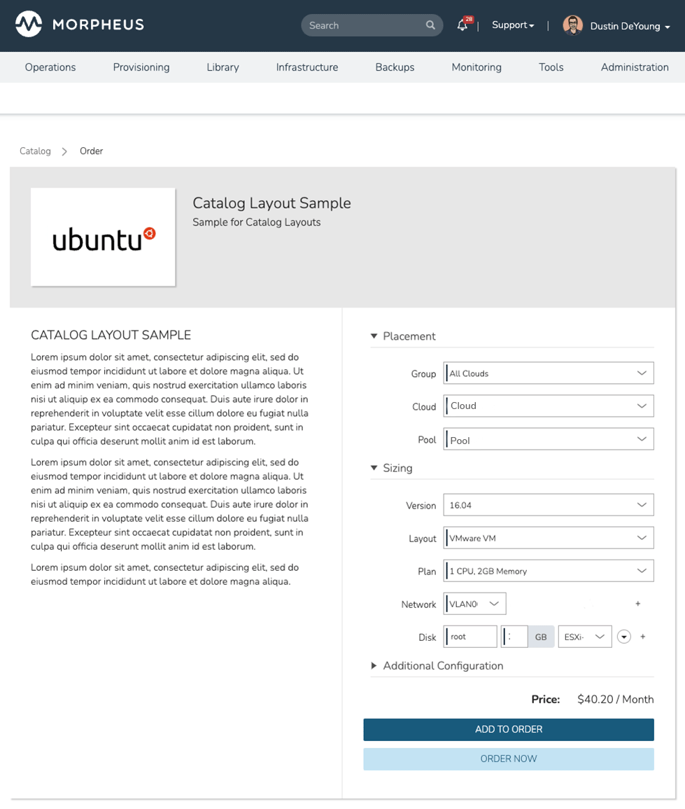

# Morpheus Catalog Layout Plugin

This plugin provides additional layout selections during catalog item creation and edit.

### Building
`./gradlew shadowJar`

### Configuration
Once the plugin is uploaded to the Morpheus UI, a `Layout` field should be visible when either creating or editing a catalog item. The field should open up a drop-down with the layout options.

#### Layouts
The layout options are:
| Layout  | Description |
| ------------- | ------------- |
| Default | The default layout selection. The content and form are split side-by-side, in a 1:1 ratio. |
| Stacked | The content is displayed above the form. The form is centered and narrower than the full width. |
| Centered Form Only | The form is centered and narrower than the full width. Intended for when there is no content. |
| Wide Form | The content and form are split side-by-side, in a 1:2 ratio. Intended for when the form labels are long and/or the content is short. |
| Narrow Form | The content and form are split side-by-side, in a 2:1 ratio. Intended for when the content is long and/or the form labels are short. |

